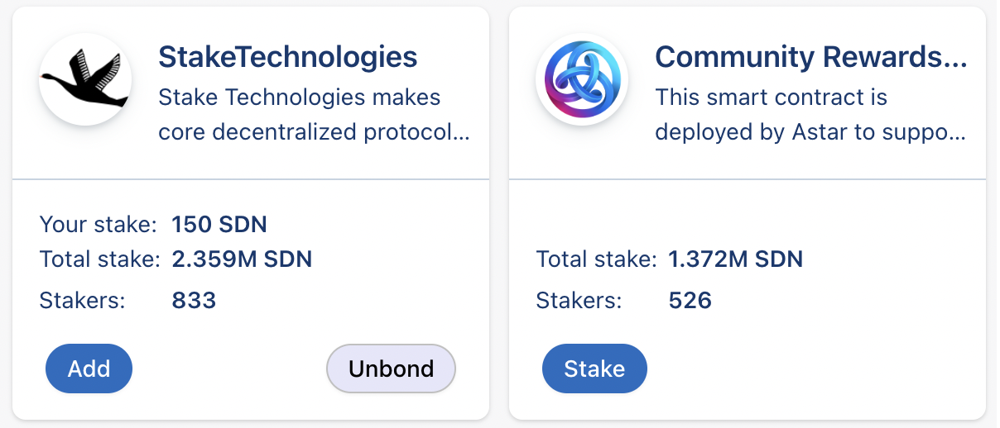
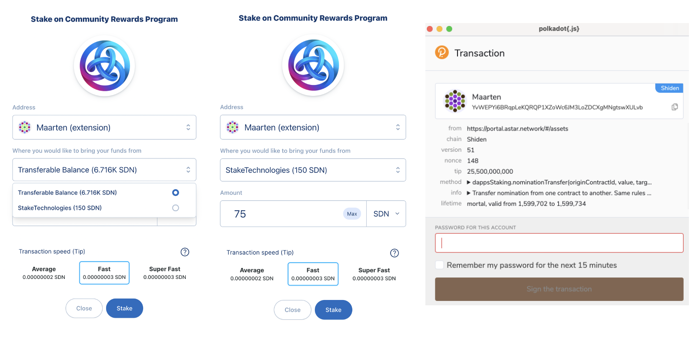
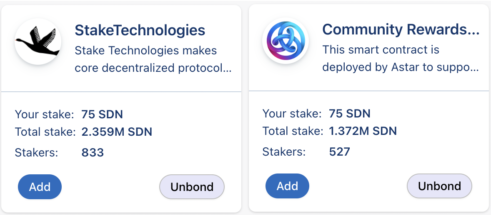

# 指名転送

指名転送により、ステーカーは結合解除（unbonding）期間をスキップしながら、指名の全体または一部を他のプロジェクトに転送することができます。 このように、ステーカーは興味のあるプロジェクトをサポートするために、結合解除（unbonding）期間でステーキング報酬を犠牲にする必要はありません。

dApp Staking は、エコシステムのプロジェクトと開発者をサポートするように設計されています。 dApp Staking を通じたステーキングは、あなたがサポートしたいプロジェクトに投票を与えています。 あなたの投票（ステーク） は、プロトコルの収益に影響を与えます。

## 手順

[dApp Stakingページ](https://portal.astar.network/#/dapp-staking/discover)に移動すると、dApp Stakingメカニズムに記載されているすべてのdAppが表示されます。 記載されている手順はすべてAstar Networkにあり、同じです。

この機能は、dAppで既にステーキングしているステーカーのみ使用できます。 あなたが初めてdApp Stakingメカニズムのステーキングをするのであれば、[こちら](staking)のステップーバイーステップガイド を参照してください。

## 使用例

私は150のSDNを *Stake Technologies* にステークしましたが、*Community Reward* dAppも応援したいため、その一部を転送したいと考えています。

あなたはサポートしたいdAppの **Stake** ボタンをクリックして転送ウィンドウを開きます。 あなたは使用したい資金を、転送可能なウォレット内の資金か、ステーク先の別のdAppから選択し使用することができます。 この場合、 *Stake Technologies* から *Community Rewards* プログラムに資金を転送します。 転送したい金額を入力し（Shidenの場合、最小 50 SDN）、 **Stake**をクリックします。 あなたが最後にトランザクションへ署名することによってこのプロセスは完了します。

これで、トークンの結合を解除（unbond）することなく、ステークの一部を新しいdAppに転送したことがわかります。

