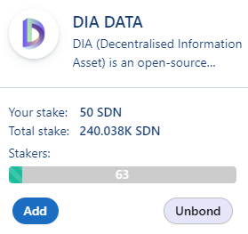
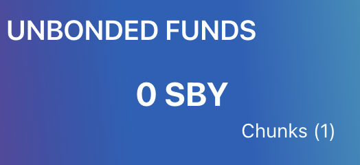

# ステークの結合解除

## 概要

dApp Staking v2 に向けて 最初の新しい実装は、結合解除（Unbonding）期間です。 一般的には、結合（bonding）はトークンが一時的にロックされるプロセスです。 ステーキングはトークンを結合する必要があるシナリオの1つです。 結合解除（Unbonding）とは、これらのトークンのロックを解除することをネットワークに伝えることです。 Shidenは5日間、Astarは10日間の結合解除時間の後。 トークンを引き出すことができ、そしてそれらは転送可能な残高になります。 この日数は完全にブロックを生成する時間がおよそ12秒である事に基づいています。 遅延が発生した場合は、結合解除（unbonding）期間が少し長くなることがあります。

| ネットワーク | 結合解除期間 |
| ------ | ------ |
| Astar  | 10 日間  |
| Shiden | 5 日間   |

## 結合解除の方法

dAppsのいずれかにステークした場合は、「Unbond」をクリックしてトークンを転送可能にすることができます。

**Unbond**する金額を選択し、「**Max**」をクリックすることで、すべてのステークの結合解除します。 「**Start Unbonding**」をクリックし、トランザクションに署名しると結合解除を開始します。

**Chunks**を確認してください

 

Chunk とは、 あなたがトークンの結合解除をしたい異なる ERA の数です。 Chunks はあなたが要求したdAppの結合解除の量と同じではありませんが、あなたがトークンの結合解除をした異なるERAの量です。

'Chunk'を引き出します。 結合解除期間が終了したら、「Withdraw」ボタンをクリックして資金を引き出す必要があります。 トランザクションに署名すると、トークンはあなたのウォレットで転送可能になります。

