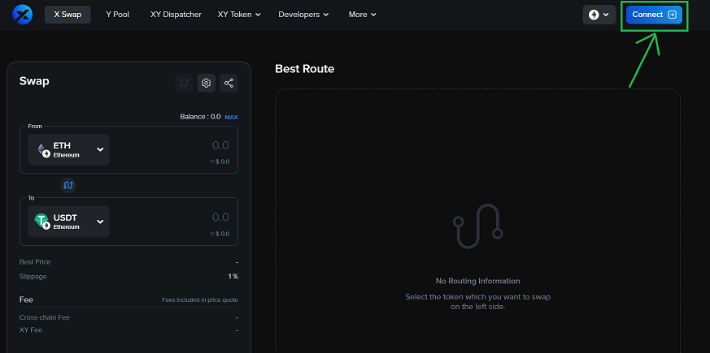
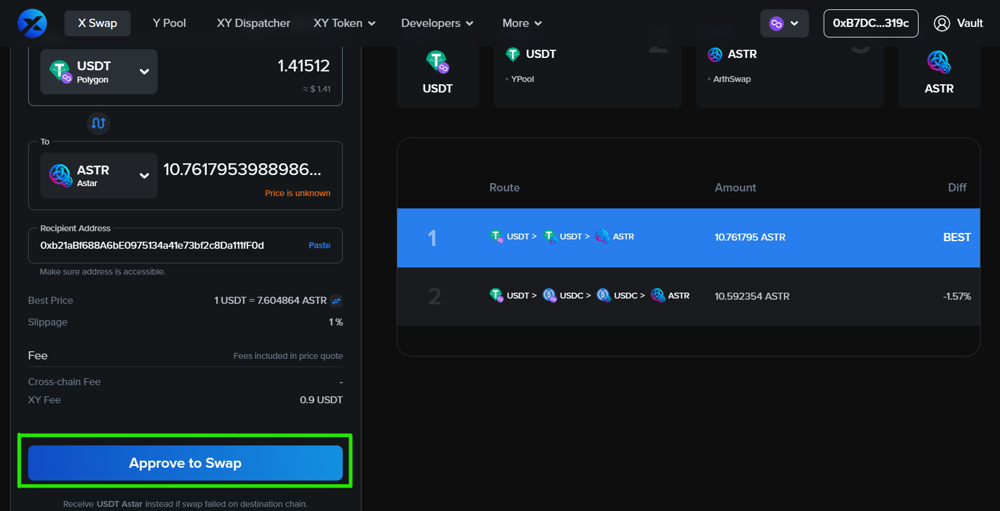

# 主要なEVMチェーンからAstarへのクロスチェーン資産のスワップ

このチュートリアルでは、少なくとも12個のEVMチェーンからAstarへのクロスチェーンスワップの作成方法について説明します。

## XY FinanceのXスワップページに移動する

XY Financeは、DeFi & Metaverse向けのクロスチェーンスワップアグリゲータです。 ユーザーは、1つのトランザクションで他のチェーンからAstarでASTRやその他のトークンを直接購入することができます。 現在、XYファイナンスは、Ethereum、BSC、Fantom、Polygon、Arbitrum、Optimism、AvalancheC-Chain、Cronos、KCC、Thunderbore、Apar、Moonriverなど12のEVMチェーンをサポートしています。

## ウォレットを接続する

「Connect Wallet」ボタンをクリックします。

XYファイナンスが提供する簡単な機能を探索する前に、ウォレットを接続する必要があります。 XY Finance は現在、デスクトップ ブラウザーで Metamask と WalletConnect をサポートしており、モバイルではより多くの種類のウォレットがサポートされています。

## スワップトークン

ソース・チェーンで交換したいトークンと、Astarで受け取るトークンを選択します。 ここでは、ポリゴンのUSDTをAstarのASTRにスワップする例を紹介します。 XY Financeが提供するサービスにより、EVMユーザーは1回のトランザクションで直接ASTRを取得することができます。

## トークン金額を入力

交換したいUSDTの数量を入力します。

受取先のアドレスを二重チェックしてください。 XY Financeは、接続されたウォレットアドレスをデフォルトで表示します。受信者のアドレスは変更することもできます。

「Approve to Swap」ボタンをクリックすると、ウォレットがアクションを確認するよう求められます。

# スワップ

「Approve to Swap」ボタンをクリックすると、ウォレットがアクションを確認するよう求められます。 ウォレットでこのトランザクションを確認します。

数分後にAstar NetworkでASTRを受信することが出来ます。
