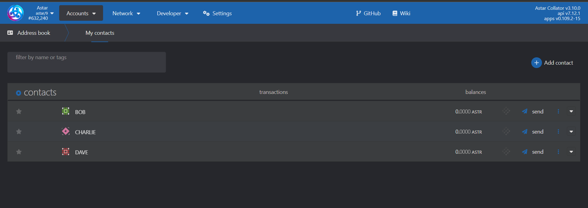
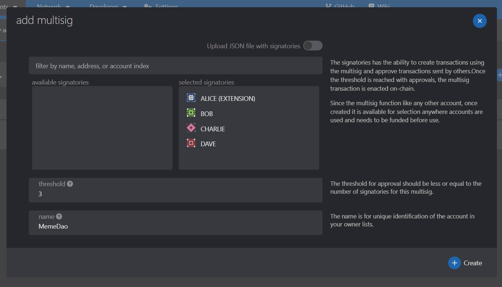

# マルチシグウォレットの作成

このチュートリアルはマルチシグのSubstrateウォレットを作成するためのガイドとして役立ちます。

## コンタクトの追加

1. [https://polkadot.js.org/apps/?rpc=wss%3A%2F%2Frpc.astar.network#/accounts](https://polkadot.js.org/apps/?rpc=wss%3A%2F%2Frpc.astar.network#/accounts)を開く
2. Accounts -> Address Bookを開きます。
3. `+ Add Contact` をクリックし、マルチシグウォレットに含めたいすべてのアドレスを追加する
4. 例：Bob、Charlie、Dave

## 新しいウォレットを作成

1. Accounts -> `+ Multisig`を開く
2. 使用可能な署名から、マルチシグに含める署名を選択する。
3. しきい値を追加する。 しきい値 2 は、トランザクションに署名するために最低 2 人の署名者が必要であることを意味する。
4. マルチシグウォレットに名前を付ける。
5. 「Create」をクリックする。

## ウォレットのテスト

1. 上記の通りマルチシグウォレットの作成を完了させる。
2. マルチシグウォレットのテストには、まずShibuya testnetを利用することを推奨する。 自身のウォレットを接続することで、 [https://portal.astar.network](https://portal.astar.network) からSBYを取得できる。
3. SBYを取得した後、SBYトークンをマルチシグウォレットに送信すると、使用を開始できる。
