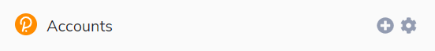
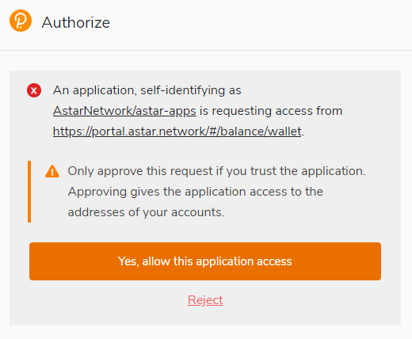

# Astar Walletの作成

## Astarアカウント

### アドレスフォーマット

Astar のような Substrateベースチェーンで使用されるアドレス形式はSS58です。 SS58は、BitcoinのBase-58-checkに若干の修正を加えたものです。 注目すべきは、アドレスが特定のネットワークに属することを識別するための、アドレスタイププレフィックスを含むフォーマットを含むことです。 Astarエコシステムは、WASMスマートコントラクトとしてEVMをサポートする唯一のParachainであるため、Polkadotエコシステムの中でも特別なParachainとなっています。 2種類の仮想マシンを使用することで、2種類のアドレスが使われます。

- Astarネイティブアドレス、もしくはSS58アドレス
- 0xで始まるAstar EVMアドレス、もしくはH160アドレス

WASM dApps、またはdApps Stakingページを使用するときに、Astarネイティブアドレスを使用します。 このアドレスを使用するには、MetaMask以外の拡張機能が必要です。 エコシステムに慣れていない場合は、Polkadot JS extension を使用することをお勧めします。

## Astar Portal

[Astar Portal][] は、私たちのエコシステムにおいて何でも行うための場所です。 Astarの開発者は、エコシステムで交流したいすべての人のためのワンストッププレースを作りました。

Portalを通じて、Astarエコシステムのさまざまなネットワークに接続できます。

- **Astar Network**: PolkadotのParachain
- **Shiden Network**: KusamaのParachain
- **Shibuya**: テストネットParachain

## 推奨: Polkadot\{.js\} ブラウザプラグイン

Polkadot\{.js\}プラグインは、セキュリティとユーザビリティの合理的なバランスを提供します。 これは、あなたのアドレスを生成し、Astarポータルと対話するための独立したローカルメカニズムを提供します。 エコシステムが初めてで、Astarネイティブアドレスを作成したいユーザーはこのウォレットを使用することを推奨します。 Polkadot JS 拡張機能がない場合、ウォレットを接続しようとすると、Astar Portalでポップアップが表示されます。

### ブラウザプラグインをインストール

ブラウザプラグインは、 [Google Chrome](https://chrome.google.com/webstore/detail/polkadot%7Bjs%7D-extension/mopnmbcafieddcagagdcbnhejhlodfdd?hl=en) (および Brave などの Chromium ベースのブラウザ) と [Firefox](https://addons.mozilla.org/en-US/firefox/addon/polkadot-js-extension) の両方で利用できます。 プラグインをインストールした後、ブラウザのメニューバーに、オレンジ色と白色の Polkadot\{.js\} ロゴが表示されます。

### アカウント作成

ブラウザのトップバーにあるロゴをクリックして、Polkadot\{.js\}ブラウザ拡張機能を開いてください。 ブラウザポップアップ表示されます。

「Create new account」という大きなプラスボタンをクリックします。 Polkadot\{.js\}プラグインは、システムのランダム性を利用して、あなたのために新しいSeedを作り、12個の単語の形で表示します。

これらの言葉をバックアップするべきです。 安全な場所にSeedを保管してください。 何らかの理由でPolkadot\{.js\}からアカウントにアクセスできない場合は、「Add account menu」から「Import account from pre-existing seed」を選択することで、Seedを再入力することが可能です。

Polkadotエコシステム内のどのチェーンでも許可されるアカウントを作成するのがベストです。 このアカウントはPolkadotとKusamaで使用できます。 チェーンに接続すると、アカウントのフォーマットが自動的に変更されます。

**descriptive name** は任意であり、自分用に設定できます。 ブロックチェーンに保存されていないため、ブロックエクスプローラであなたのアドレスを見る他のユーザーには表示されません。 複数のアカウントを使用している場合は、必要に応じて詳細な説明としてこれを作成すると役立ちます。

**password** は、アカウントの情報を暗号化するために使用されます。 このアカウントを使って何らかの発信をするときや、メッセージを暗号化して署名するときには、再入力する必要があります。

:::danger
このパスワードはSeedフレーズを保護しません ****。 もし誰かがmnemonic seedの12個の単語を知っていれば、パスワードを知らなくても、あなたのアカウントをコントロールすることができるのです。
:::

「Add the account with the generated seed」をクリックすると、アカウントが作成されます。 その際、アカウントを json ファイルとして安全な場所に保存することをお勧めします。

## Astar Portalにウォレットを接続

[Astar Portal][] に戻り、ページを更新します。 Polkadot JSをPortalで使用するために認証が必要であるというポップアップが表示されます。 拡張機能に許可を与えてください！

拡張機能にアクセス許可を与えられたら、ウォレットを接続しましょう。 使用可能なすべての拡張機能のポップアップが表示されます。 Polkadot JSで新しいアカウントを作成しただけなので、この拡張機能を選択しましょう。

「Polkadot JS」をクリックすると、新しく作成したアカウントを選択できます。 アカウントを選択し、「confirm」を押します。

Astarウォレットを私たちのポータルに正常に接続しました。 なお、このウォレットは、Dotsamaのエコシステムに含まれるすべてのParachainで使用することができます。

## サポート

なにかお困りのことはありますか？ 私たちのコミュニティに参加すると、アンバサダーがあなたをサポートします。 私たちが最初にDMを送ることは決してありません！覚えておいてください。 チームの一員と偽って声をかけられても、信用しないようにしましょう。

[Astar Portal]: https://portal.astar.network/
