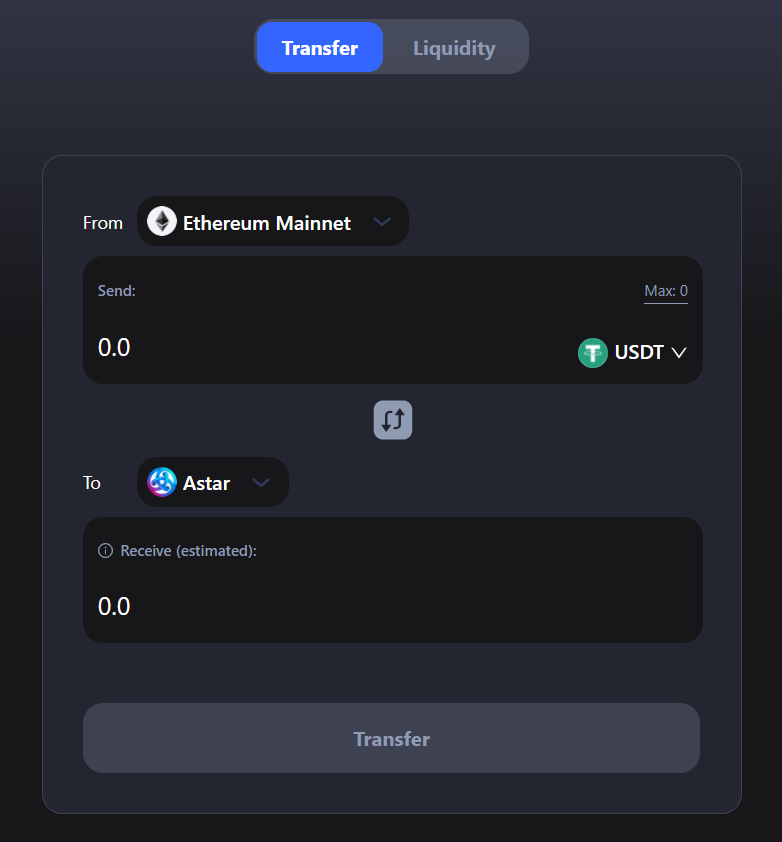

# DEXでASTRを購入

Astar Networkには、DEXがいくつかあります。 Arthswapはその一つです。 ArthswapはEVM上に構築されているため、EVM環境で接続する必要があります。

## MetaMaskのセットアップ

Metamask拡張機能を開く-> 設定 -> ネットワーク -> ネットワークを追加

以下のカスタムRPCを使用してください。

**Nネットワーク名**: Astar   **新しいRPC URL**: [https://evm.astar.network](https://evm.astar.network)   **チェーンID**: 592   **通貨記号**: ASTR   **ブロックエクスプローラーのURL**: [https://blockscout.com/astar](https://blockscout.com/astar)

## EthereumのアセットをAstar Networkにブリッジ

ASTRを購入するには、スワップに使用できる他のアセットが必要です。 wETH、USDT、USDCなどのEthereumアセットをAstar Networkに橋渡しするのは一つの手です。

1. [http://app.arthswap.org/#/swap](http://app.arthswap.org/#/swap) に移動します。
2. 「ブリッジ」をクリックすると、 [https://cbridge.celer.network/#/transfer](https://cbridge.celer.network/#/transfer) に移動します。
3. 「Transfer」に移動し、「From Ethereum」と「To Astar」を選択し、Metamaskを接続します。
4. 例えばブリッジするアセットにUSDTを選択します。
5. 「Transfer」をクリックすると、Astar Network上にUSDTを移動できます。
6. ブリッジ料金を支払う必要があります。また、Astar Networkでトランザクションに必要なガス代のASTRトークンも受け取ります。

## Arthswapでスワップ

1. [http://app.arthswap.org/#/swap](http://app.arthswap.org/#/swap) に移動し、Metamaskを接続します。
2. USDTからwASTRへのスワップを選択し、必要な量を入力します。
3. スワップを実行し、トランザクションに署名します。
4. wASTRを入手したので、ASTRにスワップできます。
5. これであなたのウォレットにはASTRトークンが入っています。

ASTRをMetamaskで保有しており、dAppにステークにしたい場合はPolkadot.jsに送信することができます。 前のチュートリアルを参照してください。
