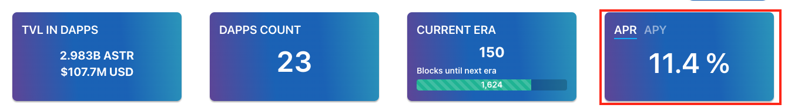

# Para stakers

## Visão Geral

Você gosta de fazer stake? Ou quer apoiar seu projeto favorito fazendo um dapp staking nele? Você pode se educar lendo a documentação com cuidado. Caso tenha qualquer dúvida, entre em nosso canal no Discord.

Por favor, tenha em consideração os seguintes parâmetros:

- A **quantidade mínima** de participação para usuários no dapp staking é de **50 SDN ou 500 ASTR.**
- **Você precisa reivindicar suas recompensas, recomendamos que você reivindique suas recompensas de staking uma vez por semana.**
- Há um período de vínculo por cerca de 5 dias na Shiden e 10 dias na Astar. Por favor, note que isto é baseado em uma produção perfeita de bloco de 12s. Em caso de atraso, o seu período de desvinculação pode ser um pouco mais longo.
- As recompensas de staking são mostradas no APY por padrão. A opção APY está disponível para participantes que permitiram a acumulação composta, ativando a opção 'Re-stake após reivindicação'. Por outro lado, a opção APR está disponível para participantes que não ativaram a acumulação composta. A diferença é que a APR representa a taxa anual de recompensas e a APY toma em consideração a acumulação composta gerada nesse período.



Outras páginas que podem ser interessantes:

```mdx-code-block
import DocCardList from '@theme/DocCardList';
import {useCurrentSidebarCategory} from '@docusaurus/theme-common';

<DocCardList items={useCurrentSidebarCategory().items}/>
```
