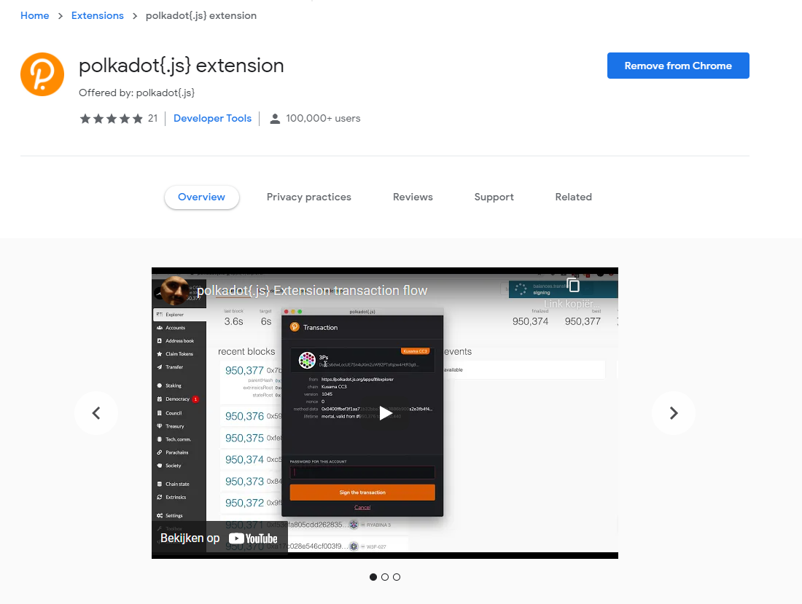
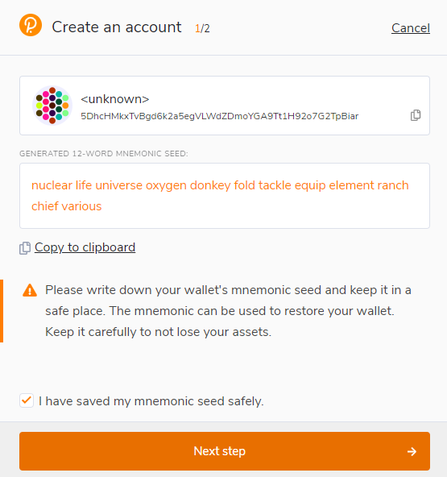

# Criando uma carteira Astar

## Contas Astar

### Formato de endereço

O formato de endereço usado em cadeias baseadas no Substrate como Astar é SS58. SS58 é uma modificação do Base-58-check do Bitcoin com algumas pequenas modificações. Notavelmente, o formato contém um prefixo de tipo de endereço que identifica um endereço como pertencente a uma rede específica. O ecossistema Astar é uma parachain especial no ecossistema Polkadot porque é a única parachain que suporta EVM como contrato inteligente WASM. Com o uso de duas máquinas virtuais diferentes, surgem dois tipos diferentes de endereços.

- Um endereço nativo de Astar ou endereço SS58
- Um endereço Astar EVM ou endereço H160 que começa com 0x

Você irá interagir com nosso endereço nativo Astar quando o uso de dApps WASM estiver pronto ou nossa página de dApps Staking. Usar este endereço requer outra extensão que não seja a MetaMask. Recomendamos usar a extensão Polkadot JS se você for novo no ecossistema.

## Portal Astar

O [Portal Astar][] é o local ideal para fazer qualquer coisa em nosso ecossistema. Os desenvolvedores de Astar criaram um local único para todos que desejam interagir em nosso ecossistema.

Através do nosso portal, você pode se conectar a diferentes redes no ecossistema Astar.

- **Astar Network**: parachain em Polkadot.
- **Shiden Network**: parachain em Kusama.
- **Shibuya**: parachain testnet

## Recomendado: Plugin de navegador Polkadot{.js}

O plug-in Polkadot{.js} oferece um equilíbrio razoável de segurança e usabilidade. Ele fornece um mecanismo local separado para gerar seu endereço e interagir com o portal Astar. Recomendamos que os usuários que são novos em nosso ecossistema e desejam criar um endereço nativo de Astar usem esta carteira. Se você não tiver a extensão Polkadot JS, receberá um pop-up em nosso portal quando tentar conectar sua carteira.

### Instale o plug-in do navegador

O plug-in do navegador está disponível para [Google Chrome](https://chrome.google.com/webstore/detail/polkadot%7Bjs%7D-extension/mopnmbcafieddcagagdcbnhejhlodfdd?hl=en) (e navegadores baseados em Chromium como o Brave) e [Firefox](https://addons.mozilla.org/en-US/firefox/addon/polkadot-js-extension). Após instalar o plugin, você deverá ver o logotipo laranja e branco da Polkadot{.js} na barra de menu do seu navegador.

### Criar uma conta

Abra a extensão do navegador Polkadot{.js} clicando no logotipo na barra superior do navegador. Você verá um pop-up do navegador.

Clique no grande botão de adição - "Create new account". O plug-in Polkadot{.js} usará a aleatoriedade do sistema para criar uma nova seed para você e exibi-la na forma de doze palavras.

Você deve fazer backup dessas palavras. Por favor, guarde a seed em algum lugar secreto e seguro. Se você não puder acessar sua conta via Polkadot{.js} por algum motivo, você pode reinserir sua seed através do menu "Add account" selecionando "Import account from pre-existing seed".

Melhor criar uma conta "allowed on any chain" do ecossistema Polkadot. Essa conta pode ser usada para Polkadot e Kusama. Sua conta mudará automaticamente de formato quando conectada a uma cadeia.

Um **descriptive name** é arbitrário e somente para seu uso. Ele não é armazenado na blockchain e não será visível para outros usuários que visualizam seu endereço por meio de um explorador de blocos. Se você estiver gerenciado várias contas, é útil tornar isso tão descritivo e detalhado quanto necessário.

Um **password** será usado para criptografar as informações desta conta. Você precisará reinseri-lo ao usar a conta para qualquer tipo de transação de saída ou ao usá-la para assinar criptograficamente uma mensagem.

:::perigo
Observe que essa senha **NÃO** protege sua frase inicial. Se alguém souber as doze palavras em sua seed mnemônica, ainda terá controle sobre sua conta, mesmo que não saiba a senha.
:::

Após clicar em "Add the account with the generated seed", sua conta está criada. Recomendamos também salvar sua conta como arquivo json em algum lugar seguro.

## Conectar sua carteira ao Portal Astar

Retorne ao [Portal Astar][] e atualize a página. Você receberá um popup que a Polkadot JS precisa ser autorizada a ser usada em nosso portal. Dê a permissão à extensão para fazê-la!

Quando você tiver dado a permissão da extensão, vamos conectar a carteira. Um popup irá aparecer com todas as extensões possíveis. Nós apenas criamos uma nova conta com a Polkadot JS, então vamos selecionar esta extensão.

Depois de clicar na Polkadot JS, você pode selecionar sua conta recém-criada. Selecione sua conta e pressione confirmar.

Agora você conectou com sucesso uma carteira Astar ao nosso portal. Note que você pode usar esta carteira em todos as parachains no ecossistema de Dotsama.

## Suporte

Caso tenha algum problema. Junte-se à nossa comunidade e nossos embaixadores irão te ajudar. Por favor, lembre-se de que nós nunca DM primeiro! Se alguém se aproximar de você fingindo fazer parte da equipe, não confie.

[Portal Astar]: https://portal.astar.network/
