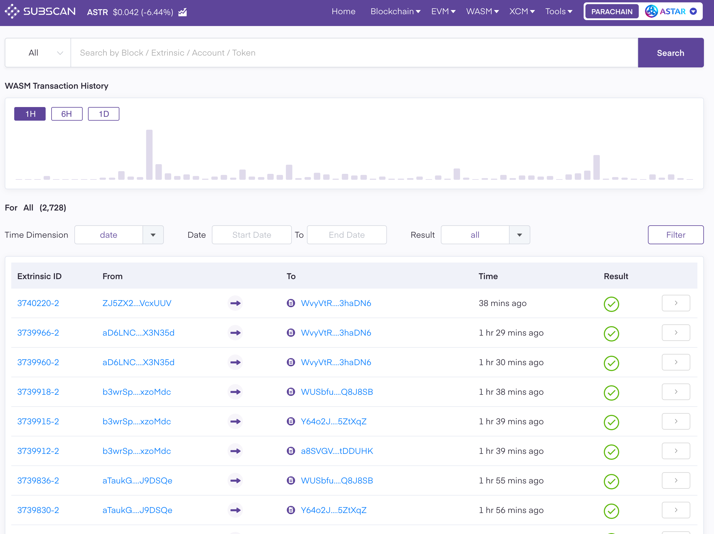
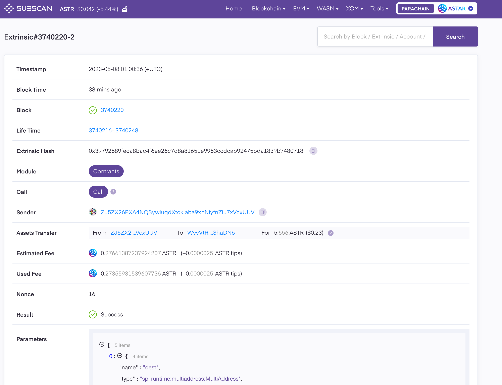
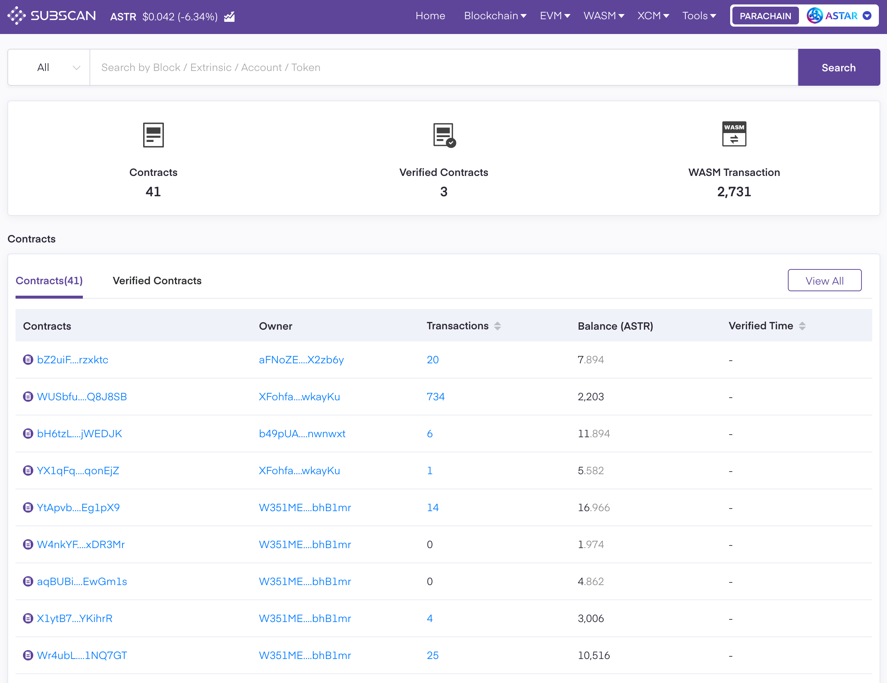
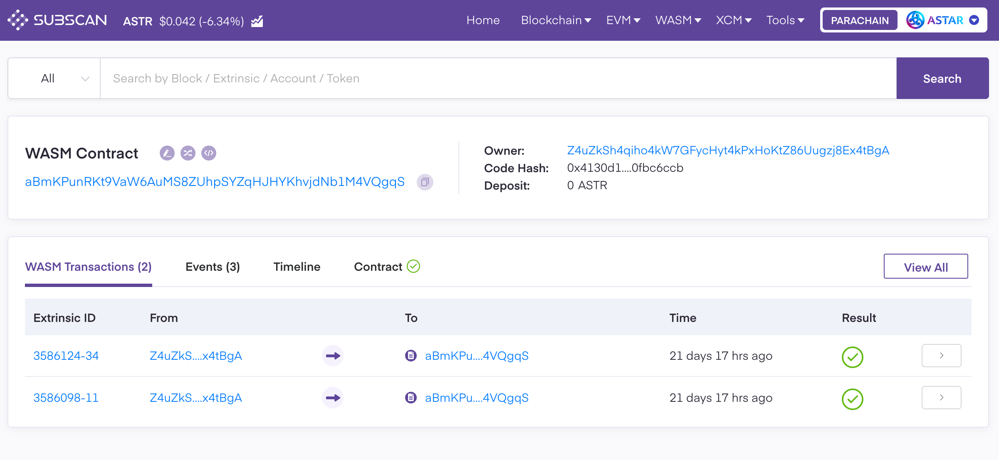
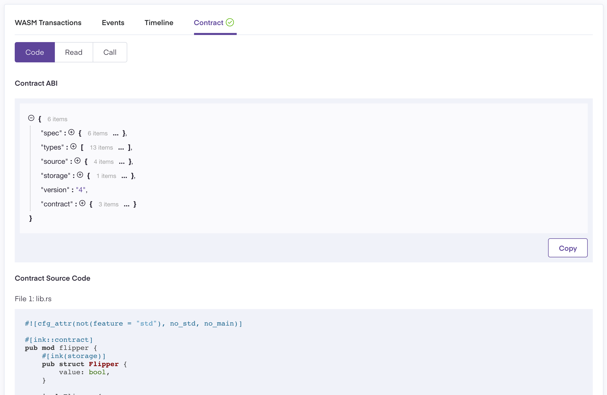
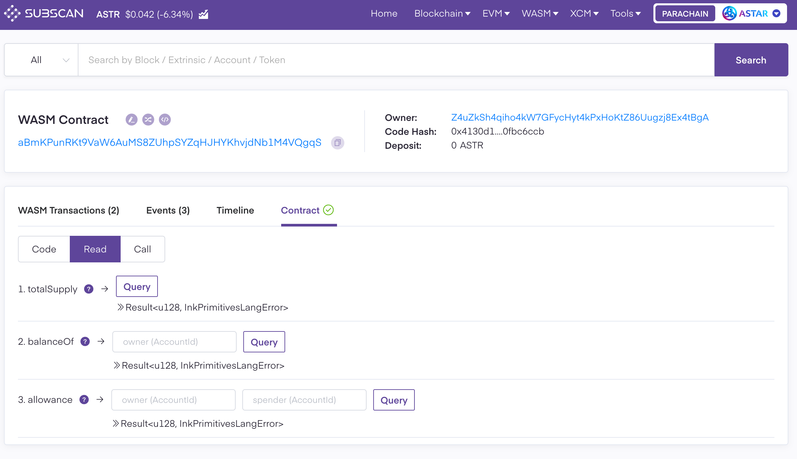
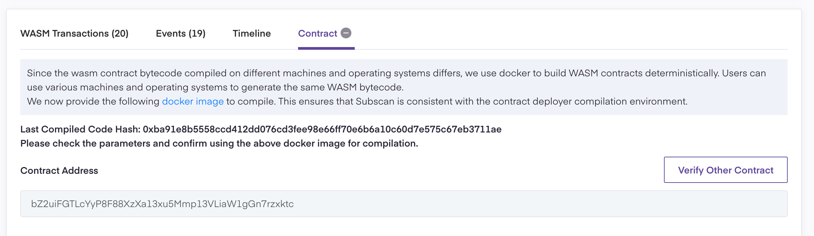

# Subscan
## Introduction

A Substrate ecological explorer that not only allows ordinary users to view WASM smart contract and transaction detail but also provides developers with WASM smart contract verification and read/call capabilities.

## Prerequisites
 - [Subscan WASM smart contract dashboard for Astar network](https://astar.subscan.io/wasm_contract_dashboard)
 - Basic WASM smart contract knowledge
 - polkadot{.js} extension (optional, it's used to call WASM smart contract)

## Getting started

### View WASM Transactions and Detail

Visit [Transactions](https://astar.subscan.io/wasm_transaction) under the WASM category in Subscan navbar.

Click on the link in list item to view transaction Detail.

### View WASM Smart Contracts and Detail

Visit [Transactions](https://astar.subscan.io/wasm_transaction) under WASM category in Subscan navbar.

Click on the link in the list item to view contract detail.

### Verify WASM Smart Contract

Visit [WASM Contract Verification Tool](https://astar.subscan.io/verify_wasm_contract) under Tools category in Subscan 
navbar or [Contract tab in contract detail](https://astar.subscan.io/wasm_contract/bZ2uiFGTLcYyP8F88XzXa13xu5Mmp13VLiaW1gGn7rzxktc?tab=contract) to verify WASM smart contract

As the tip section says, we provide [docker images](https://quay.io/repository/subscan-explorer/wasm-compile-build?tab=tags) for developers to compile contract. This ensures that Subscan is consistent with the contract deployer compilation environment.

After compiling contract in docker, you need to fill in the Contract Verification form and submit Code and Cargo file from docker. The contract verification process will run in the background and may take 5 to 10 minutes. Once it's done, you'll see contract abi and source code in contract detail, and you can read/call the contract as you like now.

### Read/Call WASM Smart Contract
Visit [Contract tab in contract detail](https://astar.subscan.io/wasm_contract/aBmKPunRKt9VaW6AuMS8ZUhpSYZqHJHYKhvjdNb1M4VQgqS?tab=contract&contractTab=read). Please note that read/call features only apply to verified WASM smart contract, and you need to connect to polkadot{.js} extension before calling contract.

## Troubleshooting

**I've submitted the contract verification form, but the contract is still not verified**

It happens mainly in two situations:
1. The verifying process is still undergoing. Just wait for 5 to 10 minutes and check again
2. Verification failed. In this case, you'll see Last Compiled Code Hash as follows. Please check the parameters and confirm using the above docker image for compilation.

## Learn more

[Contracts API Docs](https://support.subscan.io/#contracts-api) by Subscan
